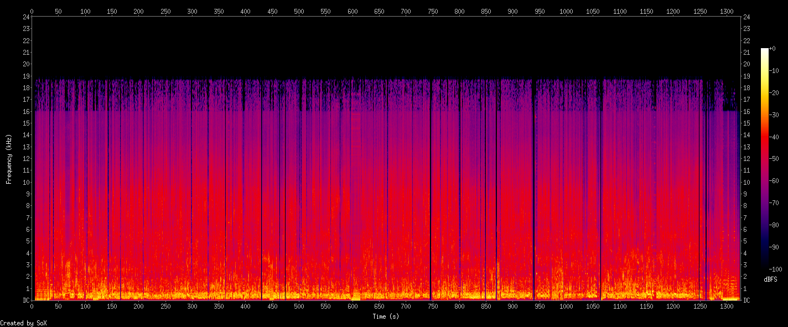
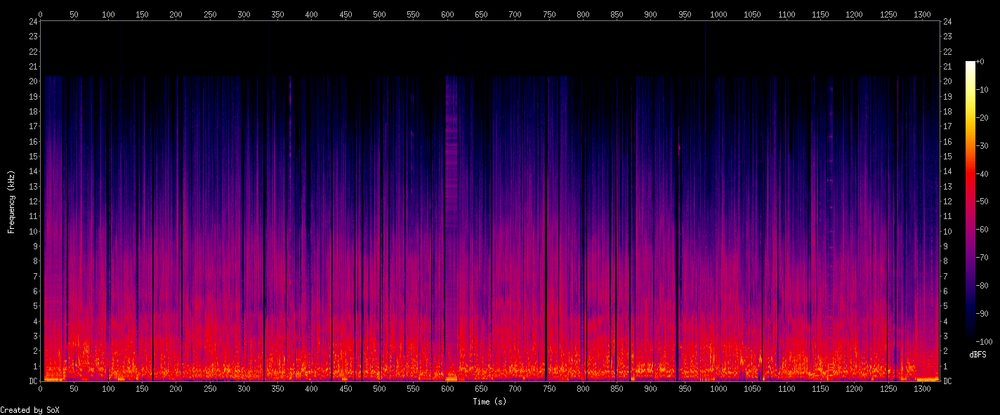

bad quality: mp3 192kbps



good quality: ac3 192kbps



```
$ ffmpeg -i South.Park.S06E01.Jared.hat.Aides.German.DL.DVDRip.XviD.avi
Input #0, avi, from 'South.Park.S06E01.Jared.hat.Aides.German.DL.DVDRip.XviD.avi':
  Duration: 00:22:04.70, start: 0.000000, bitrate: 1306 kb/s
  Stream #0:0: Video: mpeg4 (Advanced Simple Profile) (XVID / 0x44495658), yuv420p, 576x432 [SAR 1:1 DAR 4:3], 908 kb/s, 23.98 fps, 23.98 tbr, 23.98 tbn
  Stream #0:1: Audio: mp3 (U[0][0][0] / 0x0055), 48000 Hz, stereo, fltp, 192 kb/s
  Stream #0:2: Audio: ac3 ([0] [0][0] / 0x2000), 48000 Hz, stereo, fltp, 192 kb/s
```
